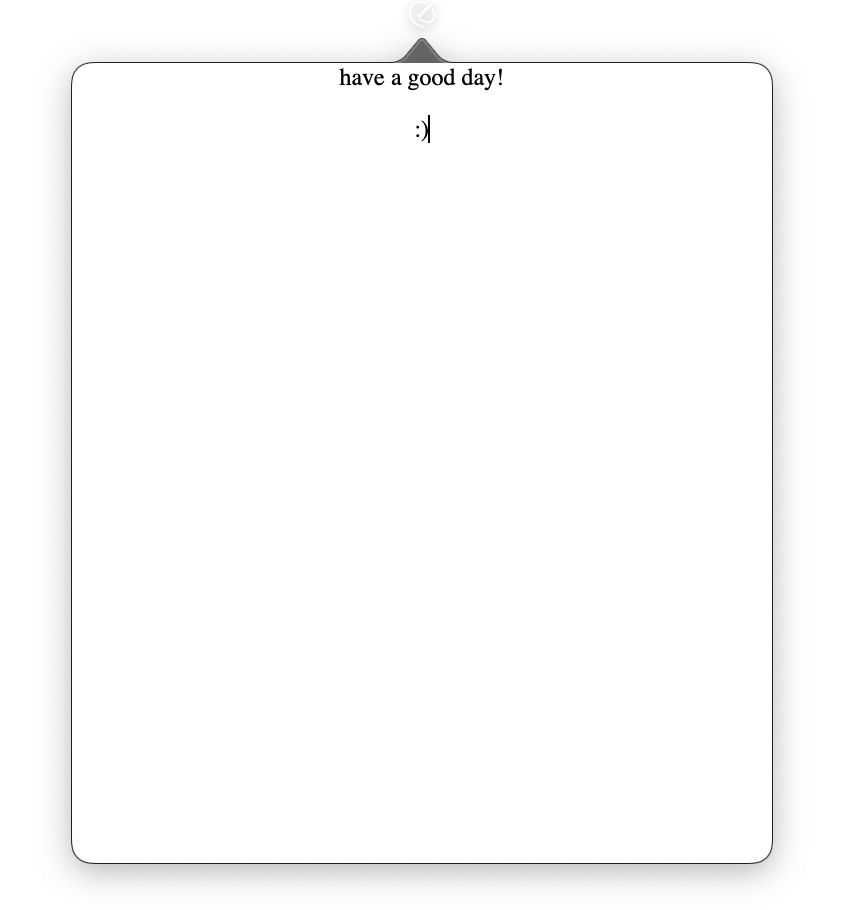

# Draft

Draft è un'applicazione menu bar per macOS che offre un foglio di carta virtuale sempre accessibile dalla barra dei menu. È progettata per prendere note al volo, inserire link, immagini e altri contenuti, tenendo tutto a portata di mano senza interrompere il flusso di lavoro.

## Caratteristiche

- Foglio di scrittura virtuale sempre disponibile con un clic sulla barra dei menu
- Editor di testo ricco con supporto per formattazione, elenchi e stili
- Facile inserimento di link, immagini e altri contenuti multimediali
- Salvataggio automatico di tutti i tuoi appunti
- Interfaccia minimale senza finestre separate che disturbano il flusso di lavoro
- Supporto per drag & drop di contenuti
- Accesso rapido e immediato ai tuoi appunti ovunque ti trovi nel sistema

## Requisiti

- macOS 11.0 o successivo
- Xcode 13.0 o successivo (per compilare)

## Installazione

1. Scarica l'ultima versione dal [repository delle release](https://github.com/USERNAME/draft/releases)
2. Monta il file DMG e trascina l'app nella cartella Applicazioni
3. Apri l'app dalla cartella Applicazioni

## Come si usa

Draft è stato progettato per essere semplice e intuitivo:

1. **Accesso rapido**: Clicca sull'icona di Draft nella barra dei menu di macOS per far apparire il foglio di carta virtuale
2. **Scrittura di note**: Inizia a scrivere immediatamente nel foglio, senza attese o configurazioni
3. **Inserimento di contenuti**:
   - **Link**: Incolla o trascina URL per creare link cliccabili
   - **Immagini**: Trascina immagini direttamente nel foglio o usa il menu contestuale
   - **File**: Trascina file per creare riferimenti rapidi
4. **Persistenza**: Tutti i contenuti vengono salvati automaticamente
5. **Nascondi quando non serve**: Clicca fuori dal foglio o premi ESC per nasconderlo e tornare al tuo lavoro

Il foglio virtuale è sempre disponibile quando ne hai bisogno, senza dover cercare l'app o interrompere il tuo flusso di lavoro.

## Sviluppo

### Prerequisiti

- Xcode 13.0 o successivo
- Command Line Tools per Xcode

### Compilazione

1. Clona questo repository
2. Apri il progetto `draft.xcodeproj` in Xcode
3. Seleziona il target "draft" e compila
4. Per creare un DMG, esegui `./create_menu_bar_dmg.sh` dal terminale

### Creazione del DMG

Lo script `create_menu_bar_dmg.sh` automatizza il processo di creazione di un file DMG per la distribuzione, impostando l'applicazione come app per la barra dei menu (Menu Bar App).

```bash
chmod +x create_menu_bar_dmg.sh
./create_menu_bar_dmg.sh
```

## Licenza

Questo progetto è distribuito sotto licenza MIT. Vedi il file `LICENSE` per ulteriori dettagli.

## Screenshot


*Il foglio di carta virtuale con alcune note e un'immagine*

## Contribuire

Siamo aperti a contributi! Se vuoi migliorare Draft:

1. Fai un fork del progetto
2. Crea un nuovo branch per la tua feature (`git checkout -b feature/amazing-feature`)
3. Fai commit delle tue modifiche (`git commit -m 'Aggiunta una nuova feature'`)
4. Fai push sul branch (`git push origin feature/amazing-feature`)
5. Apri una Pull Request

## Contatti

Se hai domande, suggerimenti o riscontri, non esitare ad aprire un issue nel repository GitHub.
